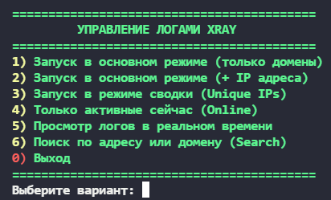

# Xray Logs Viewer 📊

Профессиональный инструмент для анализа и визуализации логов `access.log` сервера Xray-core. Скрипт превращает сырые данные логов в структурированный, читаемый отчет с группировкой по пользователям и автоматическим определением геолокации.

## 🌟 Основные возможности

* **Geo-IP & ASN**: Мгновенное определение страны и интернет-провайдера (ASN) для каждого IP-адреса.
* **Интеллектуальная подсветка**: 
    * 🔴 **Красный**: Российские и белорусские домены/IP, сервисы VK, Yandex, Mail.ru, Kaspersky.
    * 🟡 **Желтый**: Подозрительные китайские ресурсы (Xiaomi, Alibaba, Baidu и др.).
* **Группировка по Email**: Все действия привязаны к конкретным пользователям с поддержкой числовой сортировки (1.user, 2.user, 10.user).
* **Режимы отображения**:
    1.  **Только домены**: Чистый список посещенных ресурсов.
    2.  **Домены + IP**: Полная техническая информация.
    3.  **Unique IPs**: Сводка — сколько разных адресов использовал каждый клиент.
    4.  **Online**: Список активных в данную секунду соединений.
* **Живой поиск**: Мгновенный поиск по любой части домена, IP-адреса или имени пользователя.

## 📸 Интерфейс



## 🚀 Быстрая установка

Для установки или обновления используйте команду в одну строку:

```bash
curl -sSL https://raw.githubusercontent.com/Rxxich/xray-logs-viewer/main/install.sh | sudo bash
```
🛠 Использование
После завершения установки просто введите команду в терминале:
```bash
xray_logs
```
При первом запуске скрипт автоматически скачает необходимые базы данных GeoLite2 (City и ASN) для корректной работы геолокации.

## 📜 Благодарности (Credits)
Основано на логике парсинга логов, разработанной Davoyan. Данная версия является расширенной модификацией с добавлением:
    Полноценного интерактивного меню.
    Расширенной базы подсвечиваемых доменов.
    Автоматического установщика.
    Системы поиска и онлайн-мониторинга.
## 📋 Системные требования
    ОС: Linux (Ubuntu/Debian).
    Зависимости: Python 3, python3-geoip2, net-tools (устанавливаются автоматически).
    Конфигурация Xray: В конфиге Xray должен быть включен access.log.
